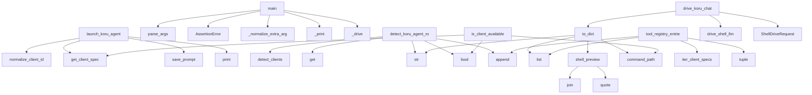

# System Architecture Analysis
<!-- generated in 0.00s -->

## Overview

- **Project**: /home/tom/github/semcod/sllm
- **Primary Language**: python
- **Languages**: python: 8, yaml: 2, txt: 1, shell: 1, toml: 1
- **Analysis Mode**: static
- **Total Functions**: 46
- **Total Classes**: 9
- **Modules**: 13
- **Entry Points**: 19

## Architecture by Module

### src.sillm.controller
- **Functions**: 11
- **Classes**: 6
- **File**: `controller.py`

### src.sillm.compat
- **Functions**: 11
- **File**: `compat.py`

### src.sillm.cli
- **Functions**: 7
- **File**: `cli.py`

### src.sillm.registry
- **Functions**: 6
- **Classes**: 1
- **File**: `registry.py`

### src.sillm.validation
- **Functions**: 6
- **Classes**: 1
- **File**: `validation.py`

### src.sillm.nlp
- **Functions**: 5
- **Classes**: 1
- **File**: `nlp.py`

## Key Entry Points

Main execution flows into the system:

### src.sillm.compat.launch_koru_agent
> Launch a Koru agent through SILLM while preserving TTY behavior.

Clients with a file/arg prompt contract receive the prompt directly.
Stdin-only clie
- **Calls**: src.sillm.registry.normalize_client_id, src.sillm.registry.get_client_spec, src.sillm.controller.save_prompt, print, print, print, ShellDriveRequest, src.sillm.controller.build_drive_plan

### src.sillm.cli.main
- **Calls**: None.parse_args, AssertionError, src.sillm.cli._normalize_extra_arg_tokens, src.sillm.cli._print, src.sillm.cli._drive, src.sillm.cli._nlp, src.sillm.cli._print, src.sillm.cli._build_parser

### src.sillm.compat.detect_koru_agent_rows
> Return SLLM clients in Koru ``AgentOption.to_dict`` shape.
- **Calls**: src.sillm.registry.detect_clients, row.get, str, bool, rows.append, row.get, bool, bool

### src.sillm.controller.ShellDrivePlan.to_dict
- **Calls**: list, self.shell_preview, str, str

### src.sillm.registry.ShellClientSpec.to_dict
- **Calls**: self.command_path, list, list, list

### src.sillm.compat.tool_registry_entries
- **Calls**: src.sillm.registry.iter_client_specs, tuple, entries.append, list

### src.sillm.compat.is_client_available
- **Calls**: src.sillm.registry.get_client_spec, bool, spec.command_path

### src.sillm.compat.drive_koru_chat
- **Calls**: src.sillm.controller.drive_shell_llm, result.to_dict, ShellDriveRequest

### src.sillm.controller.ShellDrivePlan.shell_preview
- **Calls**: None.join, shlex.quote

### src.sillm.controller.ShellDriveResult.to_dict
- **Calls**: list, str

### src.sillm.compat.shell_client_ids
- **Calls**: tuple, src.sillm.registry.iter_client_specs

### src.sillm.compat.shell_process_patterns
- **Calls**: tuple, src.sillm.registry.iter_client_specs

### src.sillm.registry.ShellClientSpec.command_path
- **Calls**: resolver

### src.sillm.validation.ValidationResult.to_dict
- **Calls**: list

### src.sillm.compat.autopilot_backend_for_client
- **Calls**: src.sillm.compat.is_shell_llm_client

### src.sillm.validation.intent_contracts

### src.sillm.nlp.ShellIntent.to_dsl

### src.sillm.compat.agent_backend_profiles
> Return Koru-compatible backend profile metadata for shell LLM control.

### src.sillm.compat.agent_backend_aliases
> Return Koru backend aliases owned by SLLM.

## Process Flows

Key execution flows identified:

### Flow 1: launch_koru_agent
```
launch_koru_agent [src.sillm.compat]
  └─ →> normalize_client_id
  └─ →> get_client_spec
      └─> normalize_client_id
  └─ →> save_prompt
      └─> _prompt_root
```

### Flow 2: main
```
main [src.sillm.cli]
  └─> _normalize_extra_arg_tokens
  └─> _print
```

### Flow 3: detect_koru_agent_rows
```
detect_koru_agent_rows [src.sillm.compat]
  └─ →> detect_clients
      └─> normalize_client_id
```

### Flow 4: to_dict
```
to_dict [src.sillm.controller.ShellDrivePlan]
```

### Flow 5: tool_registry_entries
```
tool_registry_entries [src.sillm.compat]
  └─ →> iter_client_specs
```

### Flow 6: is_client_available
```
is_client_available [src.sillm.compat]
  └─ →> get_client_spec
      └─> normalize_client_id
```

### Flow 7: drive_koru_chat
```
drive_koru_chat [src.sillm.compat]
  └─ →> drive_shell_llm
      └─> build_drive_plan
          └─> _resolve_spec
          └─> _resolve_command
```

### Flow 8: shell_preview
```
shell_preview [src.sillm.controller.ShellDrivePlan]
```

### Flow 9: shell_client_ids
```
shell_client_ids [src.sillm.compat]
  └─ →> iter_client_specs
```

### Flow 10: shell_process_patterns
```
shell_process_patterns [src.sillm.compat]
  └─ →> iter_client_specs
```

## Key Classes

### src.sillm.controller.ShellDrivePlan
- **Methods**: 2
- **Key Methods**: src.sillm.controller.ShellDrivePlan.shell_preview, src.sillm.controller.ShellDrivePlan.to_dict

### src.sillm.registry.ShellClientSpec
- **Methods**: 2
- **Key Methods**: src.sillm.registry.ShellClientSpec.command_path, src.sillm.registry.ShellClientSpec.to_dict

### src.sillm.controller.ShellDriveResult
- **Methods**: 1
- **Key Methods**: src.sillm.controller.ShellDriveResult.to_dict

### src.sillm.validation.ValidationResult
- **Methods**: 1
- **Key Methods**: src.sillm.validation.ValidationResult.to_dict

### src.sillm.nlp.ShellIntent
- **Methods**: 1
- **Key Methods**: src.sillm.nlp.ShellIntent.to_dsl

### src.sillm.controller.SllmError
> Base error for SLLM control failures.
- **Methods**: 0
- **Inherits**: RuntimeError

### src.sillm.controller.UnknownClientError
> Requested client is not registered.
- **Methods**: 0
- **Inherits**: SllmError

### src.sillm.controller.ClientUnavailableError
> Registered client command is not available in PATH.
- **Methods**: 0
- **Inherits**: SllmError

### src.sillm.controller.ShellDriveRequest
- **Methods**: 0

## Data Transformation Functions

Key functions that process and transform data:

### src.sillm.cli._build_parser
- **Output to**: argparse.ArgumentParser, parser.add_subparsers, sub.add_parser, clients.add_argument, sub.add_parser

### src.sillm.validation.validate_intent
- **Output to**: ValidationResult, src.sillm.registry.get_client_spec, errors.append, intent.prompt.strip, errors.append

### src.sillm.validation._validate_raw_dsl
- **Output to**: raw_dsl.get, isinstance, str, str, isinstance

### src.sillm.validation.validate_intent_contracts
- **Output to**: parse_contract_line, list, errors.append, parsed.append, list

### src.sillm.compat.shell_process_patterns
- **Output to**: tuple, src.sillm.registry.iter_client_specs

## Public API Surface

Functions exposed as public API (no underscore prefix):

- `src.sillm.compat.launch_koru_agent` - 17 calls
- `src.sillm.cli.main` - 11 calls
- `src.sillm.controller.build_drive_plan` - 11 calls
- `src.sillm.controller.drive_shell_llm` - 10 calls
- `src.sillm.compat.detect_koru_agent_rows` - 9 calls
- `src.sillm.validation.validate_intent` - 8 calls
- `src.sillm.controller.save_prompt` - 7 calls
- `src.sillm.validation.validate_intent_contracts` - 6 calls
- `src.sillm.nlp.intent_from_text` - 5 calls
- `src.sillm.controller.ShellDrivePlan.to_dict` - 4 calls
- `src.sillm.registry.ShellClientSpec.to_dict` - 4 calls
- `src.sillm.registry.normalize_client_id` - 4 calls
- `src.sillm.validation.ecosystem_status` - 4 calls
- `src.sillm.compat.tool_registry_entries` - 4 calls
- `src.sillm.registry.detect_clients` - 3 calls
- `src.sillm.compat.is_client_available` - 3 calls
- `src.sillm.compat.drive_koru_chat` - 3 calls
- `src.sillm.controller.ShellDrivePlan.shell_preview` - 2 calls
- `src.sillm.controller.ShellDriveResult.to_dict` - 2 calls
- `src.sillm.controller.result_from_error` - 2 calls
- `src.sillm.compat.shell_client_ids` - 2 calls
- `src.sillm.compat.shell_process_patterns` - 2 calls
- `src.sillm.registry.ShellClientSpec.command_path` - 1 calls
- `src.sillm.registry.get_client_spec` - 1 calls
- `src.sillm.validation.ValidationResult.to_dict` - 1 calls
- `src.sillm.compat.is_shell_llm_client` - 1 calls
- `src.sillm.compat.autopilot_backend_for_client` - 1 calls
- `src.sillm.registry.iter_client_specs` - 0 calls
- `src.sillm.validation.intent_contracts` - 0 calls
- `src.sillm.nlp.ShellIntent.to_dsl` - 0 calls
- `src.sillm.compat.agent_backend_profiles` - 0 calls
- `src.sillm.compat.agent_backend_aliases` - 0 calls

## System Interactions

How components interact:



## Reverse Engineering Guidelines

1. **Entry Points**: Start analysis from the entry points listed above
2. **Core Logic**: Focus on classes with many methods
3. **Data Flow**: Follow data transformation functions
4. **Process Flows**: Use the flow diagrams for execution paths
5. **API Surface**: Public API functions reveal the interface

## Context for LLM

Maintain the identified architectural patterns and public API surface when suggesting changes.